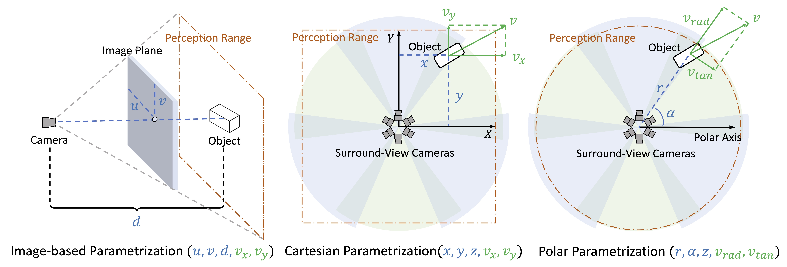
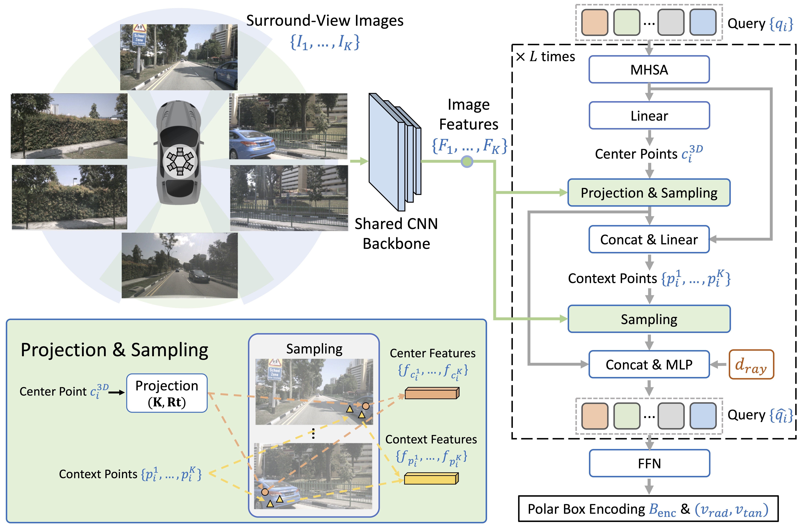
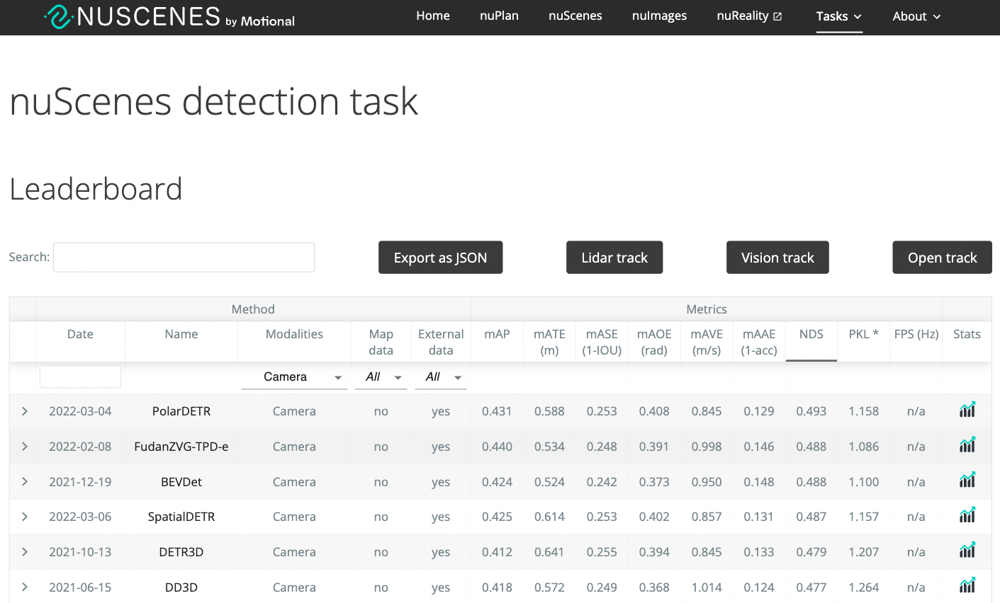
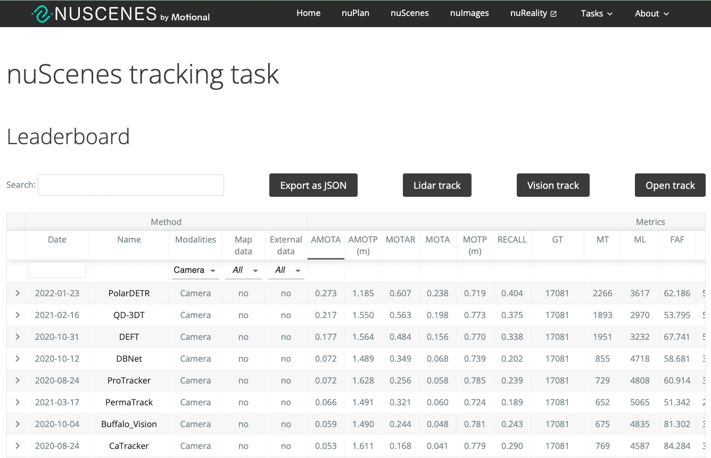

<div align="center">
<h1> PolarDETR </h1>
<span><font size="5", > Polar Parametrization for Vision-based Surround-View 3D Detection </font></span>
<br>


by 
<br>Shaoyu Chen, Xinggang Wang</a><sup><span>&#8224;</span></sup>,  Tianheng Cheng, Qian Zhang, Chang Huang, Wenyu Liu. 
<br>(<span>&#8224;</span>: corresponding author)

<div><a href="https://arxiv.org/abs/2206.10965">[Paper] </a></div> 


<div align="center">

</div>

</div>

## Overview
We reformulate position parametrization, velocity decomposition, perception range, 
label assignment and loss function in polar coordinate system.
Polar parametrization establishes explicit associations between image patterns and prediction targets, exploiting
the view symmetry of surround-view cameras.
<div align="center">

</div>
Framework
<div align="center">

</div>


PolarDETR ranks 1st on the nuScenes benchmark at the submission time.
Following are snapshots of nuScenes benchmark on Mar. 6th, 2022.
<div align="center">


</div>


## Citation
```BibTeX
@article{PolarDETR,
  author    = {Chen, Shaoyu and and Wang, Xinggang and Cheng, Tianheng and Zhang, Qian and Huang, Chang and Liu, Wenyu},
  title     = {Polar Parametrization for Vision-based Surround-View 3D Detection},
  journal   = {arXiv:2206.10965},
  year      = {2022},
}
``` 
